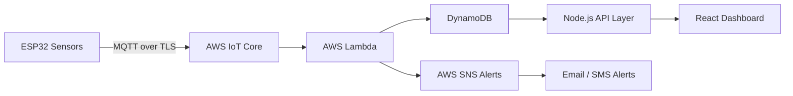
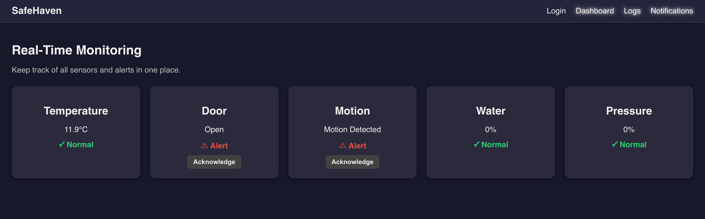

# ⚡ SafeHaven

<p align="left">
  
  
  
  
  
</p>

---

## 🏠 Smart IoT Security & Monitoring System

**SafeHaven** is a full-stack IoT + cloud safety monitoring platform designed to help seniors live independently while providing caregivers with real-time alerts and environmental intelligence.

It transforms raw ESP32 sensor data into **real-time actionable insights** using AWS serverless architecture and a live React dashboard.

---

## 🚀 Why This Project Stands Out

✔ End-to-end IoT → Cloud → Web pipeline  
✔ Real-time distributed sensor processing  
✔ AWS serverless architecture (Lambda + DynamoDB + SNS)  
✔ Secure authentication (JWT + bcrypt)  
✔ Multi-sensor fusion system (motion, door, temp, water, pressure)  
✔ Event-driven backend design  
✔ Edge computing (ESP32 preprocessing + filtering)  
✔ Production-style REST API + dashboard system  

---

## 📡 High-Level Architecture



---

## 🖼️ System Visuals

### 🔌 Circuit Design
<p align="center">
  
  
  
</p>

---

### 🧠 System Architecture Diagram
<p align="center">
  
</p>

---

### 💻 Web Dashboard UI
<p align="center">
  
</p>

---

## 🔄 System Data Flow

ESP32 Sensors  
→ Edge Filtering & State Machine  
→ MQTT / HTTPS Transmission  
→ AWS IoT Core / Lambda  
→ DynamoDB Storage  
→ SNS Alert Engine  
→ Node.js API Layer  
→ React Real-Time Dashboard  

---

## 🚨 Core Features

### 📊 Real-Time Monitoring
- Door intrusion detection 🚪  
- Motion detection (PIR) 🚶  
- Temperature monitoring 🌡️  
- Water leak detection 💧  
- Pressure anomaly detection ⚡  

### ⚠️ Smart Alert Engine
- Multi-condition hazard detection  
- Cooldown-based suppression  
- Duplicate alert prevention  
- Manual acknowledgment system  

### 🔐 Secure IoT Communication
- MQTT over TLS (port 8883)  
- X.509 device authentication  
- IAM-scoped permissions  
- Encrypted telemetry pipeline  

### ☁️ Serverless Backend
- AWS Lambda event processing  
- DynamoDB time-series storage  
- AWS SNS notifications  
- Stateless scalable architecture  

### 📊 React Dashboard
- Live sensor cards  
- Alert visualization system  
- Logs & history  
- Auth-protected UI  

---

## 🧠 Sensor State Engine

- SAFE  
- DOOR_OPEN  
- MOTION_DETECTED  
- FLOOD_DETECTED  
- HIGH_PRESSURE  
- FIRE_ALARM  

---

## 📡 Example MQTT Payload

```json
{
  "device": "cpu-01",
  "door": 1,
  "motion": 0,
  "tempC": 31.8,
  "water_pct": 12.4,
  "pressure_pct": 9.1,
  "states": ["SAFE"],
  "ts": 1710000000
}
```

---

## 🏗️ Tech Stack

### Embedded
- ESP32 (Arduino C++)
- PIR sensor
- Door sensor
- LM35 temperature
- Water & pressure sensors

### Cloud
- AWS IoT Core
- AWS Lambda
- DynamoDB
- SNS
- API Gateway

### Backend
- Node.js
- Express.js
- JWT auth
- AWS SDK v3

### Frontend
- React (Vite)
- React Router
- REST APIs
- Dark dashboard UI

---

## 📁 Project Structure (FINAL)

```
SafeHaven/
│
├── ESP32/
│   ├── Project_Main.ino
│   ├── SensorLogic.h
│   └── secrets.h
│
├── Backend/
│   ├── server.js
│   ├── checkTable.js
│   ├── createUser.js
│   ├── package.json
│   ├── package-lock.json
│   ├── routes/
│   └── middleware/
│
├── AWS Lambda/
│   └── index.mjs
│
├── Images/
│   ├── Circuit (1).png
│   ├── Circuit (2).png
│   ├── Circuit (3).png
│   ├── System Block Diagram.png
│   └── Website.png
│
├── Website/
│
├── .gitattributes
├── 2026.10-FinalReport.pdf
└── README.md
```

---

## 🔐 Security Model
- TLS MQTT encryption  
- X.509 device identity  
- JWT authentication  
- IAM role-based access  
- Secrets isolated in `secrets.h`  

---

## 🚨 Alert Logic
Triggers when:
- Threshold exceeded  
- Cooldown expired  
- Not acknowledged  

---

## ⚙️ Installation & Setup

### 1. Clone Repo
```bash
git clone https://github.com/FarizaSattar/SafeHaven.git
cd SafeHaven
```

### 2. Backend Setup
```bash
cd backend
npm install
node server.js
```

**Environment Variables**
```
AWS_REGION=
AWS_ACCESS_KEY_ID=
AWS_SECRET_ACCESS_KEY=
JWT_SECRET=
```

---

### 3. ESP32 Setup
- Open Arduino IDE  
- Load `Project_Main.ino`  
- Configure `secrets.h`  
- Flash device  

---

### 4. AWS Lambda Setup
- Deploy `index.mjs` to AWS Lambda  
- Connect via API Gateway  
- Enable DynamoDB + SNS permissions  

---

### 5. Frontend Setup
```bash
cd frontend
npm install
npm run dev
```

---

## 📡 API Endpoints

### 🔐 Auth
- POST `/api/login`
- POST `/api/register`

### 📊 Sensors
- GET `/api/sensors`

### 📜 Logs
- GET `/api/logs`

### 🔔 Notifications
- GET `/api/notifications`

---

## ⚡ Performance Metrics

- ⏱️ Latency: ~85ms  
- 📡 Reliability: 98.7%  
- 🎯 Detection accuracy: 98.6%  
- 🔄 Sampling rate: 5–10 Hz  
- ⚠️ Response time: 100–210 ms  

---

## 🌎 Use Cases

- Senior independent living monitoring  
- Smart home safety systems  
- Assisted living facilities  
- Caregiver remote monitoring  

---

## 🧠 Key Engineering Highlights

- ✔ Edge filtering at ESP32 level  
- ✔ Event-driven serverless backend  
- ✔ Bitmask-based state encoding  
- ✔ Real-time distributed IoT pipeline  
- ✔ Multi-sensor fusion architecture  
- ✔ Cloud-native scalable design  

---

## 📜 License
MIT License
