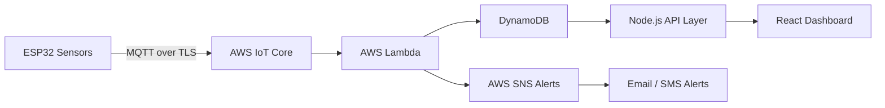

# ⚡ SafeHaven

<p align="left">
  
  
  
  
  
</p>

---

## 🏠 Smart IoT Security & Monitoring System

**SafeHaven** is a full-stack IoT + cloud safety monitoring platform designed to help seniors live independently while providing caregivers with real-time alerts and environmental intelligence.

It transforms raw ESP32 sensor data into **real-time actionable insights** using AWS serverless architecture and a live React dashboard.

---

## 🚀 Why This Project Stands Out

✔ End-to-end IoT → Cloud → Web pipeline  
✔ Real-time distributed sensor processing  
✔ AWS serverless architecture (Lambda + DynamoDB + SNS)  
✔ Secure authentication (JWT + bcrypt)  
✔ Multi-sensor fusion system (motion, door, temp, water, pressure)  
✔ Event-driven backend design  
✔ Edge computing (ESP32 preprocessing + filtering)  
✔ Production-style REST API + dashboard system  

---

## 📡 High-Level Architecture



---

## 🔄 System Data Flow

ESP32 Sensors  
→ Edge Filtering & State Machine  
→ MQTT / HTTPS Transmission  
→ AWS IoT Core / Lambda  
→ DynamoDB Storage  
→ SNS Alert Engine  
→ Node.js API Layer  
→ React Real-Time Dashboard  

---

## 🚨 Core Features

### 📊 Real-Time Monitoring
- Door intrusion detection 🚪  
- Motion detection (PIR) 🚶  
- Temperature monitoring 🌡️  
- Water leak detection 💧  
- Pressure anomaly detection ⚡  

### ⚠️ Smart Alert Engine
- Multi-condition hazard detection  
- Cooldown-based suppression (anti-spam alerts)  
- Duplicate alert prevention  
- Manual acknowledgment system  

### 🔐 Secure IoT Communication
- MQTT over TLS (port 8883)  
- X.509 device authentication  
- IAM-scoped permissions  
- Encrypted telemetry pipeline  

### ☁️ Serverless Backend
- AWS Lambda event processing  
- DynamoDB time-series storage  
- AWS SNS notifications  
- Stateless scalable architecture  

### 📊 React Dashboard
- Live sensor cards  
- Alert visualization system  
- System logs & history  
- Authentication-protected UI  

---

## 🧠 Sensor State Engine

- SAFE  
- DOOR_OPEN  
- MOTION_DETECTED  
- FLOOD_DETECTED  
- HIGH_PRESSURE  
- FIRE_ALARM  

Implemented using **bitmask-based state encoding**.

---

## 📡 Example MQTT Payload

```json
{
  "device": "cpu-01",
  "door": 1,
  "motion": 0,
  "tempC": 31.8,
  "water_pct": 12.4,
  "pressure_pct": 9.1,
  "states": ["SAFE"],
  "ts": 1710000000
}
```

---

## 🏗️ Tech Stack

### Embedded System
- ESP32 (Arduino C++)
- PIR motion sensor
- Magnetic door sensor
- LM35 temperature sensor
- Water & pressure sensors
- MQTT communication

### Cloud Infrastructure
- AWS IoT Core
- AWS Lambda
- AWS DynamoDB
- AWS SNS
- API Gateway

### Backend
- Node.js
- Express.js
- JWT Authentication
- AWS SDK v3

### Frontend
- React (Vite)
- React Router
- REST API integration
- Dark UI dashboard

---

## 📁 Project Structure (UPDATED)

```
SafeHaven/
│
├── ESP32/
│   ├── Project_Main.ino
│   ├── SensorLogic.h
│   └── secrets.h
│
├── backend/
│   ├── server.js
│   ├── checkTable.js
│   ├── createUser.js
│   ├── package.json
│   ├── package-lock.json
│   ├── routes/
│   └── middleware/
│
├── AWS Lambda/
│   └── index.mjs
│
├── Images/
│   ├── Circuit (1).png
│   ├── Circuit (2).png
│   ├── Circuit (3).png
│   ├── System Block Diagram.png
│   ├── Website (1).png
│   └── Website (2).png
│
├── Website/
│
├── .gitattributes
├── README.md
└── 2026.10-FinalReport.pdf
```

---

## 🔐 Security Model

- TLS-encrypted MQTT communication  
- Device-level X.509 authentication  
- JWT-based API access control  
- IAM role-based permissions  
- Secure secrets management (`secrets.h` excluded)  

---

## 🚨 Alert Logic

Triggers occur when:
- Sensor threshold is breached  
- AND cooldown period has expired  
- AND alert is not acknowledged  

### Supported Alerts
- Motion detected 🚶  
- Fire risk 🔥  
- Flood detected 💧  
- Pressure anomaly ⚡  
- Low battery 🔋  

---

## ⚙️ Installation & Setup

### Clone Repo
```bash
git clone https://github.com/your-username/SafeHaven.git
cd SafeHaven
```

### Backend
```bash
cd backend
npm install
node server.js
```

### ESP32
- Open Arduino IDE  
- Load `Project_Main.ino`  
- Configure `secrets.h`  
- Flash device  

### AWS Lambda
- Deploy `index.mjs`  
- Connect API Gateway  
- Enable DynamoDB + SNS  

### Frontend
```bash
cd frontend
npm install
npm run dev
```

---

## 📡 API Endpoints

### Auth
- POST `/api/login`
- POST `/api/register`

### Sensors
- GET `/api/sensors`

### Logs
- GET `/api/logs`

### Notifications
- GET `/api/notifications`

---

## ⚡ Performance Metrics

- ⏱️ Latency: ~85ms  
- 📡 Reliability: 98.7%  
- 🎯 Accuracy: 98.6%  
- 🔄 Sampling: 5–10 Hz  
- ⚠️ Response: 100–210 ms  

---

## 🌎 Use Cases

- Senior independent living  
- Smart home safety systems  
- Assisted living facilities  
- Caregiver monitoring  

---

## 🧠 Key Engineering Highlights

✔ Edge filtering at ESP32  
✔ Event-driven serverless backend  
✔ Bitmask state encoding  
✔ Real-time IoT pipeline  
✔ Multi-sensor fusion architecture  
✔ Cloud-native scalable design  

---

## 🛠️ Future Enhancements

- 📱 Mobile app (React Native)  
- 🤖 ML anomaly detection  
- 📷 Edge vision integration  
- 📊 Grafana analytics  
- 🌍 Multi-device fleet management  
- 🧠 Predictive maintenance  

---

## 📜 License

MIT License — free to use and extend.
```
